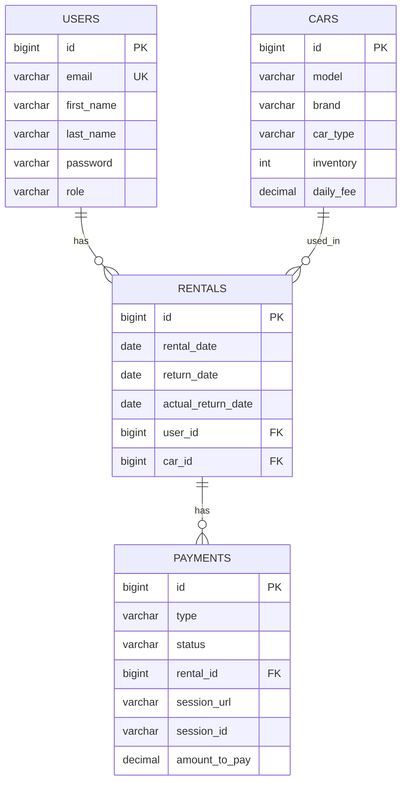

# 🚗 Car Sharing App

## 📌 Project Description

Car Sharing App is a backend application that allows users to rent cars, manage rentals, and handle payments.
The system supports authentication, role-based access, and integrates with external services like Stripe and Telegram.

---

## ⚙️ Tech Stack

* Java 17
* Spring Boot
* Spring Security (JWT)
* Spring Data JPA (Hibernate)
* MySQL
* Liquibase
* Docker & Docker Compose
* Stripe API
* Telegram Bot API
* Swagger (OpenAPI)
* Maven
* JUnit & Mockito

---

## 🔐 Roles

* **CUSTOMER**

    * Rent cars
    * Return cars
    * View own rentals and payments

* **MANAGER**

    * Manage cars (create/update/delete)
    * View all rentals and payments

---

## 🚀 Features

### 🔑 Authentication

* User registration
* JWT-based login
* Role-based access control

### 🚘 Cars

* Create, update, delete cars (MANAGER)
* View available cars

### 📦 Rentals

* Create rental
* Return rental
* Prevent multiple active rentals
* Track overdue rentals

### 💳 Payments

* Stripe integration
* Create payment session
* Success & cancel handling
* Prevent unpaid rentals

### 📩 Notifications

* Telegram notifications:

    * New rental created
    * Payment successful
    * Overdue rentals (scheduled)

---

## 🗄 Database Structure

The database schema is managed via **Liquibase**.

### Entity Relationship Diagram



## 🐳 Running with Docker

### 1. Clone project

```bash
git clone https://github.com/Yevhen4444/car-sharing-app
cd car-sharing-app
```

### 2. Create `.env` file

```env
MYSQLDB_DATABASE=car_sharing_app
MYSQLDB_USER=user
MYSQLDB_PASSWORD=password
MYSQLDB_ROOT_PASSWORD=root

JWT_SECRET=your_secret
JWT_EXPIRATION=3600000

STRIPE_SECRET_KEY=your_stripe_key

TELEGRAM_BOT_TOKEN=your_token
TELEGRAM_CHAT_ID=your_chat_id
```

### 3. Run application

Build and start all containers using Docker Compose:

```bash
docker-compose up --build
```

The application will be available at:

```text
http://localhost:8081
```

## 🌐 API Documentation

Swagger UI:

```text
http://localhost:8081/swagger-ui/index.html
```

---

## 🧪 Testing

Run tests:

```bash
mvn clean test
```

Coverage target: **60%+**

---

## 📬 API Examples

### Register

```http
POST /auth/registration
```

### Login

```http
POST /auth/login
```

### Create Rental

```http
POST /rentals
Authorization: Bearer <token>
```

---

## ⚠️ Notes

* Only one active rental per user
* Car inventory is updated automatically
* Payments must be completed before new rental
* Overdue rentals are tracked automatically

---
